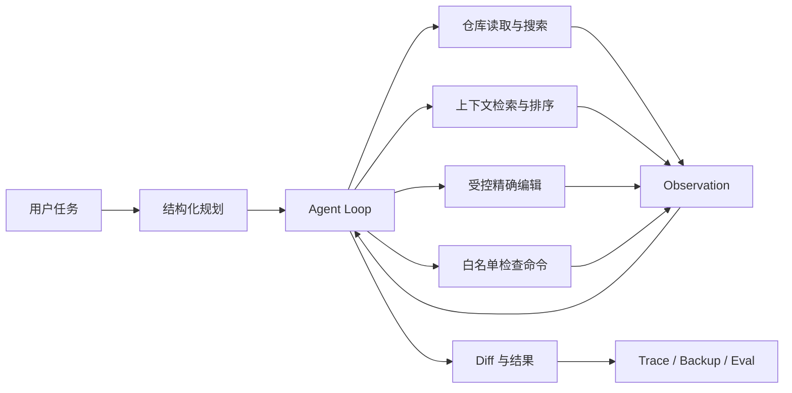

# Repo Maintainer Agent

一个面向本地代码仓库的安全、可观测维护 Agent。它能够先检查仓库，再制定计划，通过受控工具逐步读取、搜索、修改和验证代码，并保存完整执行轨迹与可恢复备份。

维护者：[@Zh0uHX](https://github.com/Zh0uHX)

本项目重点展示 Agent 工程能力，而不是封装聊天接口：

- 显式 plan–act–observe 状态循环
- 精确文本编辑与变更文件预算
- Python AST 符号、签名、import 与 qualified-name 检索
- 路径、标识符、AST 符号与代码片段联合排序的上下文检索
- 路径隔离、敏感文件保护、命令白名单
- 写入、执行测试分别授权
- 每次运行保存 JSONL trace、最终结果、diff 和原文件备份
- OpenAI-compatible 模型接口，不绑定具体厂商或 Agent 框架
- malformed JSON 进入上下文修复轮次，并统计真实请求、解析重试与累计 token
- JSONL benchmark 在临时仓库中执行，支持任务级回归测试
- 隐藏测试、修改范围断言与 mutation testing
- 运行指标、Markdown benchmark 报告与浏览器 Observatory
- CLI、可选 FastAPI 服务、CI 和容器部署

## 零密钥演示

无需配置模型即可运行确定性端到端 Demo。它会创建一个临时仓库，先复现测试失败，再执行 AST 检查、精确修复、测试复验和 Diff 审查：

```bash
python3 -m repoagent demo
```

Demo 用于验证编排、工具、安全策略和可观测性，不应被当作真实模型 benchmark。模型能力必须使用后文的 `repoagent eval` 单独评测。

## 架构



Agent 不直接获得 shell。它只能选择以下工具：

| 工具 | 作用 | 主要约束 |
|---|---|---|
| `list_files` | 枚举仓库文件 | 排除 `.git`、`.env`、依赖与构建目录 |
| `read_file` | 分页读取文本 | UTF-8、大小限制、禁止符号链接 |
| `search` | 字符串或正则搜索 | 返回数量限制 |
| `inspect_python` | 提取 Python AST 符号、签名、docstring 和 import | 只解析受限大小的 `.py` 文件 |
| `symbol_search` | 按 qualified name 搜索 Python 定义 | 返回解析错误和数量限制 |
| `retrieve_context` | 联合路径、标识符、AST 与代码证据返回相关片段 | 复用敏感文件过滤、大小和返回数量限制 |
| `edit_file` | 精确替换 | 原文本必须唯一匹配 |
| `write_file` | 创建文件 | 不能覆盖已有文件 |
| `run_check` | 执行测试或 Lint | 需显式授权且命令前缀在白名单中 |
| `diff` | 查看本次运行产生的修改 | 不依赖 Git |

`retrieve_context` 是面向大仓库任务的受控检索基础层：它支持 camelCase、snake_case 和自然语言关键词拆分，以 AST 符号边界和固定窗口生成带路径、行号的证据片段，再进行去重排序。它当前不依赖 embedding 或向量数据库，因此不宣称为语义 RAG；后续可以在不改变 Agent 工具协议的前提下接入 LangChain Retriever、embedding reranker 或向量存储。

## 快速开始

项目核心无第三方运行时依赖，Python 3.11 及以上即可运行：

```bash
export REPO_AGENT_MODEL="your-model-name"
export REPO_AGENT_API_KEY="your-api-key"
export REPO_AGENT_BASE_URL="https://api.openai.com/v1"

python3 -m repoagent run \
  "修复 add 函数的计算错误，并补充边界测试" \
  --root /absolute/path/to/repository
```

使用 DeepSeek 官方接口时，建议按其当前模型命名配置，并只在本地终端输入新生成的密钥：

```bash
export REPO_AGENT_MODEL="deepseek-v4-flash"
export REPO_AGENT_BASE_URL="https://api.deepseek.com"
read -s "REPO_AGENT_API_KEY?DeepSeek API Key: "
export REPO_AGENT_API_KEY
echo
```

不要把真实密钥写入 `.env.example`、命令历史、README、Issue 或聊天记录；已经公开过的密钥必须在供应商控制台撤销，不能通过删除本地文本恢复安全性。

需要测量上下文检索增益时，可使用 `--disable-context` 运行无该工具的对照条件；报告会记录 `context_retrieval_enabled`，禁止将不同检索条件静默续跑或合并。

默认是预览模式：Agent 可以检查仓库并生成编辑预览，但不会写入文件。确认任务和目标目录后再开启写入：

```bash
python3 -m repoagent run \
  "修复 add 函数的计算错误，并补充边界测试" \
  --root /absolute/path/to/repository \
  --apply \
  --allow-checks
```

`--apply` 和 `--allow-checks` 故意分离：写文件不意味着允许执行仓库中的代码。即使测试命令位于白名单内，测试本身仍可能执行任意项目代码。对于不可信仓库，应在容器或虚拟机中运行整个 Agent。

支持的默认检查命令包括：

```text
python[3] -m unittest
python[3] -m pytest
pytest
ruff check
mypy
npm/pnpm test
npm/pnpm run lint
cargo test/check
go test
```

命令以参数数组执行，不经过 shell；模型无法使用重定向、管道或命令替换绕过白名单。模型密钥也不会传递给检查子进程。

## 恢复修改

每次写入运行都会在目标仓库的 `.repoagent/runs/<run-id>/` 下保存首次修改前的文件。可以恢复该次运行涉及的所有文件：

```bash
python3 -m repoagent restore 20260804T120000Z-ab12cd34 \
  --root /absolute/path/to/repository
```

对已存在文件会恢复备份；由该次运行新建的文件会被删除。恢复只针对指定 run id，不调用 `git reset`。

## 执行轨迹

每次运行产生：

```text
.repoagent/runs/<run-id>/
├── trace.jsonl              # 计划、模型动作、工具结果与延迟
├── result.json              # 状态、摘要、修改文件、检查结果和 diff
├── originally_missing.json # 运行中新建的文件，可选
└── backups/                 # 每个文件首次修改前的快照
```

轨迹记录的是简短的可观察动作理由，不保存或要求模型输出隐藏思维链。仓库文件和工具输出在提示词中始终被标记为不可信数据，以降低间接 prompt injection 风险。

## 自动评测

`evals/smoke.jsonl` 提供两个最小任务。每个 case 都会在独立临时目录中构造仓库、运行 Agent，再验证目标文件中的确定性条件：

```bash
python3 -m repoagent eval evals/smoke.jsonl \
  --limit 2 \
  --output reports/benchmark.json \
  --markdown reports/benchmark.md \
  --artifacts reports/artifacts
```

评测器会在每个 case 结束后原子更新 JSON/Markdown 检查点。模型接口或网络异常会写入
`status: error`，并在 artifacts 中保存错误记录、临时仓库和 trace；修复外部问题后可直接续跑：

```bash
python3 -m repoagent eval evals/smoke.jsonl \
  --output reports/benchmark.json \
  --markdown reports/benchmark.md \
  --artifacts reports/artifacts \
  --resume
```

`--resume` 会复用同一模型、同一 AST 配置下已经完成的 case，并重试 error case。默认遇到基础设施错误立即停止，避免批量消耗额度；需要收集全部错误时显式增加 `--continue-on-error`。

JSONL case 格式：

```json
{
  "name": "fix-arithmetic-bug",
  "task": "Fix the add function so it returns a sum.",
  "files": {"maths.py": "def add(a, b):\n    return a - b\n"},
  "contains": {"maths.py": ["return a + b"]}
}
```

实际作品集建议扩展到至少 30–50 个任务，并统计：

- 任务完成率与测试通过率
- 工具选择准确率和无效动作率
- 无关文件修改率
- 平均步骤数、延迟和 token 成本
- 不同模型、提示词和工具描述的消融对比
- 路径穿越、敏感文件访问、prompt injection 的阻断率

仓库已提供10项 pilot 和 AST 消融实验：

```bash
python3 -m repoagent eval evals/pilot.jsonl \
  --output reports/pilot-ast.json \
  --markdown reports/pilot-ast.md \
  --artifacts reports/pilot-ast-artifacts

python3 -m repoagent eval evals/pilot.jsonl \
  --disable-ast \
  --output reports/pilot-string.json \
  --markdown reports/pilot-string.md \
  --artifacts reports/pilot-string-artifacts

python3 -m repoagent compare reports/pilot-string.json reports/pilot-ast.json \
  --output reports/ablation.md
```

完整协议见 [Evaluation Protocol](docs/EVALUATION.md)。

通用 pilot 不保证模型主动使用 AST。仓库另提供4项带干扰符号的代码导航探针 `evals/navigation.jsonl`；只有 AST 版本实际产生非零 `ast_tool_calls` 后，才值得运行字符串基线。

仓库另提供4项不直接给出目标符号名的行为描述任务 `evals/context_retrieval.jsonl`，用于比较保持 AST 开启时的 context disabled/enabled 条件。运行方式及有效性约束见 [Evaluation Protocol](docs/EVALUATION.md#context-retrieval-probe)。在完成真实模型对照实验前，不将该工具写入已测量的简历指标。

### 当前导航探针结果

在相同配置模型 `deepseek-chat`、相同 provider model `deepseek-v4-flash`、相同4个 case 与顺序下，单次 AST 消融结果如下：

| 指标 | String baseline | AST candidate | 变化 |
|---|---:|---:|---:|
| 通过率 | 100.0% | 100.0% | +0.0 pp |
| 平均步骤 | 9.50 | 8.50 | -10.5% |
| 平均工具调用 | 8.50 | 7.50 | -11.8% |
| 总 token | 65,662 | 57,412 | -12.6% |

这组数据支持的结论是：在该符号导航探针上，AST 工具保持了正确率并降低了执行成本；它不证明 AST 对所有仓库任务都更优。当前只有4个 case、每个条件单次运行，正式对外陈述前应扩充 holdout 并至少重复三次。详见 [完整消融报告](reports/navigation-ablation.md)、[AST 报告](reports/navigation-ast-final.md) 与 [string baseline 报告](reports/navigation-string.md)。

## API 服务

安装可选依赖后启动：

```bash
python3 -m pip install -e '.[api]'
export REPO_AGENT_ALLOWED_ROOT="/absolute/path/to/allowed/workspace"
uvicorn repoagent.api:app --host 127.0.0.1 --port 8000
```

浏览器打开 `http://127.0.0.1:8000/` 可查看 Observatory，包括运行历史、完成率、工具调用、错误、token、Diff 和逐步轨迹。CLI 也可以聚合指标：

```bash
python3 -m repoagent report --root /absolute/path/to/repository
```

API 默认禁止写入。只有明确设置以下变量后，`POST /runs` 中的对应能力才会开启：

```bash
export REPO_AGENT_ALLOW_WRITES=1
export REPO_AGENT_ALLOW_CHECKS=1
```

示例请求：

```bash
curl -X POST http://127.0.0.1:8000/runs \
  -H 'Content-Type: application/json' \
  -d '{"task":"修复失败的单元测试","root":"/absolute/path/to/repository","apply_changes":false}'
```

当前 API 同步执行请求，适合演示和单用户环境。生产部署应进一步增加任务队列、身份认证、并发限制、持久化状态和真正的 OS/容器级执行隔离。

## 本地验证

```bash
python3 -m pip install -e '.[api,dev]'
ruff check .
pytest -q
```

进一步的系统设计、安全边界和求职展示方法见：

- [架构说明](docs/ARCHITECTURE.md)
- [安全模型](SECURITY.md)
- [评测协议](docs/EVALUATION.md)
- [作品集与面试指南](PORTFOLIO.md)

## 设计边界

- 当前已支持 AST-aware inspection，但编辑仍采用唯一文本替换，可靠但不适合大规模重构。
- 备份恢复是运行级补偿机制，不替代 Git 分支或 worktree。
- 命令白名单限制入口，但不构成操作系统沙箱。
- 模型服务需兼容 Chat Completions JSON object 输出。
- 当前 benchmark 使用确定性文件断言；下一阶段可增加测试结果、轨迹匹配、LLM grader 与人工盲评。
