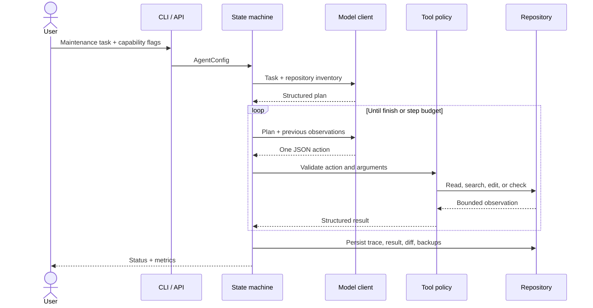

# Architecture

## Objective

RepoAgent turns a natural-language maintenance request into a bounded sequence of repository actions. The design optimizes for inspectability and failure containment rather than maximum autonomy.

## Execution model

## Components

| Component | Responsibility |
|---|---|
| `agent.py` | Planning, action loop, budgets, completion invariants |
| `tools.py` | Path policy, repository tools, command allowlist, backup and restore |
| `indexing.py` | Python AST symbols, signatures, imports and qualified-name search |
| `retrieval.py` | Bounded chunk construction, identifier tokenization, evidence ranking and deduplication |
| `llm.py` | Dependency-free OpenAI-compatible model adapter and JSON parsing |
| `metrics.py` | Trace-derived steps, tool errors, latency and token accounting |
| `evals.py` | Isolated JSONL cases, deterministic assertions, error artifacts and report rendering |
| `runstore.py` | Run history and aggregate operational metrics |
| `api.py` | FastAPI boundary, capability gates and Observatory endpoints |
| `dashboard.py` | Dependency-free browser UI embedded into the API process |

## Key design decisions

### Explicit state machine instead of a framework

The loop is implemented directly so tool selection, observations, budgets and termination are visible in code and trace data. Framework adapters can be added later without changing the policy layer.

### One action per model turn

Single-action turns make trajectories replayable and simplify error attribution. They cost more model round trips than batched actions, but provide a clearer reliability baseline.

### Exact edits instead of arbitrary patches

`edit_file` requires the old text to match exactly once. This prevents ambiguous replacements and keeps backups deterministic. AST-aware rewrites are the planned extension for larger refactors.

### Capability separation

Read access, file writes and code execution are separate capabilities. `--apply` does not imply `--allow-checks`; API writes and checks require independent server environment flags.

### Deterministic completion invariant

If the last validation command failed or timed out, the runtime changes a claimed `completed` status to `failed`. Model self-reporting cannot override observed test state.

## Data model

Each run stores an append-only JSONL trace plus a final result. Metrics are derived from the trace rather than trusted model statements. File backups record the first pre-edit state, so multiple edits in one run remain reversible.

Benchmark orchestration adds a case-level durability boundary: reports are atomically checkpointed after each case, while interrupted/error cases retain their temporary repository and partial trace. Resume accepts only matching model and AST configurations so a recovered report does not silently mix incomparable experiments.

## Extension points

- Language-specific symbol providers implementing the same inspection contract
- Embedding rerankers and LangChain-compatible retrievers behind the existing context tool
- Container-backed check runner
- Git worktree execution and PR generation
- Persistent queue for concurrent API jobs
- Retrieval over large repositories and dependency graphs
- Trajectory graders and policy-adversarial benchmark suites
